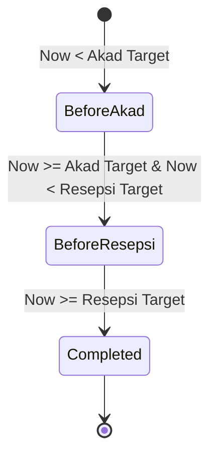
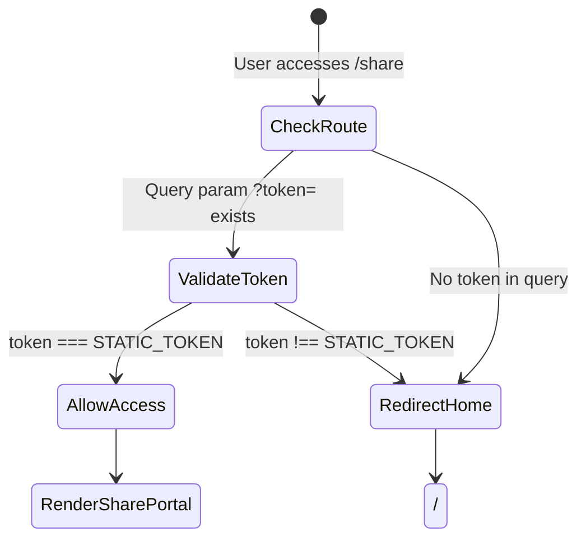

# Data Model & Schema Specifications

**Feature**: `001-wedding-invitation-portal`
**Date**: 2026-08-22
**Status**: Completed

## 1. Domain Entities & Type Definitions

### 1.1 Couple Profile Model (`types/wedding.ts`)

```typescript
export interface PersonProfile {
  fullName: string;
  shortName: string;
  fatherName: string;
  motherName: string;
  orderInFamily: string;
  instagramHandle?: string;
}

export interface CoupleData {
  groom: PersonProfile;
  bride: PersonProfile;
  monogram: string;
}
```

### 1.2 Event Schedule Model

```typescript
export type EventType = 'akad' | 'resepsi';

export interface EventDetail {
  id: EventType;
  title: string; // "Akad Nikah" | "Resepsi Pernikahan"
  dateFormatted: string; // "Minggu, 25 Oktober 2026"
  targetTimestamp: string; // ISO 8601 string: "2026-10-25T08:00:00+07:00"
  timeRange: string; // "08:00 - 10:00 WIB"
  venueName: string; // "Masjid Raya Al-Kautsar"
  venueAddress: string; // "Jl. Danau Sunter Utara No. 12, Jakarta Utara"
  mapsUrl: string; // "https://www.google.com/maps/dir/?api=1&destination=..."
  calendarUrl?: string; // Optional Google Calendar add event link
}

export interface WeddingEvents {
  akad: EventDetail;
  resepsi: EventDetail;
}
```

### 1.3 Digital Gift / Bank Account Model

```typescript
export interface BankAccount {
  id: string;
  bankName: string; // e.g., "BCA", "Mandiri", "BSI"
  bankCode?: string;
  accountNumber: string;
  accountHolder: string;
  recipientCategory: 'Mempelai Pria' | 'Mempelai Wanita';
  logoSvgKey?: string;
}
```

### 1.4 Sacred Verse Model

```typescript
export interface QuranVerse {
  surah: string; // "Ar-Rum"
  ayat: number; // 21
  arabicText: string;
  indonesianTranslation: string;
}
```

### 1.5 Guest Invitation Context Model

```typescript
export interface GuestInvitationContext {
  rawParam: string | null;
  guestName: string; // Decoded, sanitized name or default "Tamu Undangan"
  isPersonalized: boolean; // True if name came from ?to= / ?u=
}
```

### 1.6 Countdown State Model

```typescript
export type CountdownPhase = 'before_akad' | 'before_resepsi' | 'completed';

export interface CountdownTime {
  days: number;
  hours: number;
  minutes: number;
  seconds: number;
  totalRemainingMs: number;
  phase: CountdownPhase;
  phaseLabel: string; // "Menuju Akad Nikah", "Menuju Resepsi", "Acara Sedang Berlangsung / Selesai"
}
```

### 1.7 Share Portal Generator Model

```typescript
export interface ShareFormState {
  guestNameInput: string;
  encodedUrl: string;
  customMessage: string;
  whatsappDeepLink: string;
  copiedLink: boolean;
}
```

---

## 2. Static Configuration Schema (`src/data/weddingData.ts`)

All wedding data is centrally organized into a typed static dataset:

```typescript
export interface WeddingConfig {
  couple: CoupleData;
  events: WeddingEvents;
  verse: QuranVerse;
  bankAccounts: BankAccount[];
  defaultGuestFallback: string;
  staticShareToken: string;
  whatsappTemplate: (guestName: string, invitationUrl: string) => string;
}
```

---

## 3. State Transitions

### Countdown State Lifecycle



### Route Guard Access Flow


